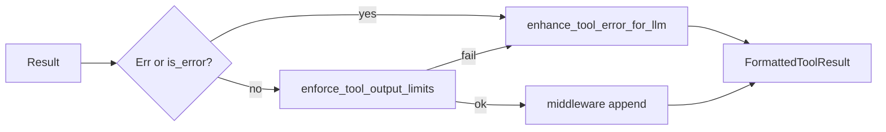

# novel-tools — Tool 系统

> 所属项目: [Novel Agent](../../README.md)

---

## 1. 业务逻辑

### 1.1 Tool Trait

- `name()` / `description()` / `usage_hint()` / `input_schema()`
- `is_read_only()` / `is_concurrency_safe()`
- **`interrupt_behavior()`** — 默认：只读 → `Cancel`，写操作 → `Block`（Write/Edit/Bash 等不可 submit-interrupt）
- `validate_input` → `check_permissions` → `call`
- **参数命名**：`input_schema()` 的 `properties` 键名和 `required` 数组中的字段名**必须使用 snake_case**（DeepSeek API 要求）；`call()` 中 `require_str` 的 key 须与 schema 一致

### 1.1.1 路径 API（`paths.rs`，跨平台）

| 函数 | 用途 |
|------|------|
| `extract_file_path` | Read/Write/Edit/Tail 必填 `file_path` |
| `optional_file_path` | 权限、Hook、进度追踪侧链 |
| `optional_search_root` | Grep/Glob 可选 `search_root`（缺省 = 作品根） |
| `normalize_rel_path` | `\` → `/`，比较与 read_economy 分类 |
| `resolve_under_project` | 相对路径 + `project_root` → `PathBuf`；绝对路径直通 |
| `normalize_chapter_progress_path` | 写章进度追踪补 `chapters/` 前缀 |

**Schema 键名：** 文件工具只用 `file_path`；Grep/Glob 搜索根用 `search_root`（不再接受 `path` 别名）。

### 1.2 ToolRegistry

`default_registry(project_root)` 注册 **23** 个工具：

**9 个通用：** Read, Write, Edit, **Tail**, Grep, Glob, Bash, WebSearch, InvokeSkill

**2 个交互：** TodoWrite, AskUserQuestion

**12 个 Novel 专属：**
CharacterSearch, PlotGraph, PlotGrid, ForeshadowTracker, Stats, Corkboard, CharacterRotate, **ForkSubAgent**, ImpactAnalysis, KnowledgeDerive, TrackingQuery, RelationQuery

（对话/节奏/情感分析由 **Subagent** ChapterCraftAnalyzer 承担，非独立主会话工具。）

### 1.3 权限系统

**PermissionMode：**

| 模式 | 行为 |
|------|------|
| Normal | 写操作 Ask 用户确认；TodoWrite / InvokeSkill 直接 Allow |
| Plan | 只读任意路径；Write/Edit 仅 `plan/`（UI 切换，无 EnterPlanMode 工具） |
| Auto | 写操作 Allow；AskUserQuestion 仍弹窗 |
| Unattended | 写操作 Allow；AskUserQuestion 不弹窗，模型自行决策 |

**PermissionResult：** Allow / Deny / Ask

**ToolContext 字段：**
- `permission_mode`, `deny_rules`, `always_allow`
- `project_root`, `session_id`
- `db` — TodoWrite 读写 `session_todos`
- `permission_mode_override` — UI 权限模式下拉（`set_permission_mode`）
- `read_file_cache` — `Option<Arc<DashMap<PathBuf, ReadCacheEntry>>>`（mtime + raw slice + offset/limit + `ReadCacheSource`；Read/Tail dedup、Edit stale/partial 校验）
- **压缩后清空：** 主会话 `compact_and_sync` 成功写回 DB 后调用 `EngineShared::clear_read_file_cache()`，避免 dedup stub 指向已摘要掉的 tool_result（对齐 `system.md`「压缩后须 Read 落盘」）

**ReadCacheSource 与 dedup：**
- `Read` / `Tail` — 工具成功写入；**参与** Read/Tail 去重（相同 path + range + mtime → stub，非 Error）
- `WriteRefresh` — Edit/Write 后 `refresh_cache_after_write`；**不参与** dedup（对齐 Claude Code；避免 stub 指向 Edit 前的 tool_result）
- Tool result 中间件见 **§1.9 Tool Result Pipeline**（`[read-dedup]`、`[fact]` 等由 pipeline 追加，非 turn_loop 硬编码）
- `skills_dir: Option<PathBuf>` — Agent skills 目录，用于 InvokeSkill 解析 skill 路径
- `allow_fork` — 主会话为 true；子 Agent 执行中为 false（禁止嵌套 fork）
- `fork_queue` — 主会话 `ForkSubAgent` 入队 `(agentType, task)`

**写路径约束：** 仅 `validate_write_root`（作品 sandbox 内 + 非受保护路径）。无 `allow_chapter_write` / 章节专禁。

### 1.4 Read-before-write

Normal 模式下 Write/Edit 要求目标 path 已在 `read_file_cache` 中（本会话曾 Read）。Plan/Auto/Unattended 可跳过。

### 1.5 AskUserQuestion

返回 `ToolError::NeedsUserInput { tool_call_id, payload }`，暂停 turn。前端 `answer_question` 提交选项后继续。

### 1.6 StreamingToolExecutor

由 `novel-core::StreamingToolDispatch` 在 **SSE 流开始前**创建；Allow 权限的 tool 在 arguments JSON 完整时即可 `add_tool`（不必等流结束）。

**调度特性：**
1. 并发工具：`Semaphore`（默认 max 10，`settings.agent.max_tool_concurrency`）
2. 串行工具：`Mutex` 独占
3. `peek_completed_results()` — 流中快照已完成结果（供 UI poll，**不 drain**）
4. `get_completed_results()` — 取出并清空已完成缓冲（turn 结束时）
5. `get_remaining_results().await` — 流结束后排空队列；连续 10 次迭代无进展 → abort 剩余（断路器）
6. `discard()` — 用户中断 / streaming fallback 时丢弃未执行 tool

**Abort 集成（`abort.rs`）：**
- `AbortSignal` / `AbortWatch` — 与 `novel-core::InterruptReason` 对应
- `InterruptBehavior::Cancel | Block` — 决定 SubmitInterrupt 时是否 synthetic abort
- `get_abort_reason` — UserCancel 立即 abort；SubmitInterrupt 仅 Cancel 工具
- `synthetic_error` — 生成 `REJECT_MESSAGE` 或 sibling 错误文本
- `has_interruptible_tool_in_progress()` — 全部 Executing 工具均为 Cancel 时返回 true
- Bash 并行 sibling 失败 → `SiblingError` 级联 abort

`execute_one_user_approved` 用于 `approve_tool`：跳过二次 `check_permissions`，直接执行用户已批准的工具。

### 1.7 工具摘要

| 工具 | 说明 |
|------|------|
| Read | 行号分页；knowledge/** 无 limit 且 >80 行工具内拒绝；全量 ≤256KB；相同 path+range+mtime 重复 → stub |
| **Tail** | 读文件物理末尾 N 行（默认 80）；续写衔接；写入 partial read cache（source=Tail）；knowledge ≤80 / chapters ≤200 行硬限 |
| Write / Edit | 写/精确替换；`replace_all`；Edit 要求唯一匹配（非 replace_all）；stale/partial read 守卫 |
| Grep | ripgrep 生态；`search_root` 可选（默认作品根）；匹配 ≤80 行 |
| Glob | 通配符搜路径（`*`/`**`/`?`；带 `/` 的前缀 pattern；无 `/` 则任意深度；`dir/*` 等价 `dir/**`）；`search_root` 可选；输出统一 `/` |
| Bash | Shell 命令 |
| TodoWrite | SQLite `session_todos`，merge 模式；Normal 模式直接 Allow |
| CharacterSearch | 人物档案 + 演变日志末行 |
| PlotGraph | 因果图 BFS |
| WebSearch | 通用网页搜索（DeepSeek `web_search_20250305`），API Key 与主对话相同：`DEEPSEEK_API_KEY` env 优先，否则 `{agent_root}/.novel-agent/api_config.json`（经 `ToolContext.global_api_config_path` → `novel_config::resolve_agent_api_key`）；失败返回 `ToolError` 而非空成功。原始结果缓存 `{project}/.websearch/`（非 `knowledge/` 正典）。支持 research/similar-works/reader-feedback/trope-reference/fact-check/writing-tips/trending/short-drama 等搜索角度 |
| PlotGrid / ForeshadowTracker | 剧情网格 / 伏笔追踪（含可视化） |
| Stats | 字数、完成率、连续天数 |
| Corkboard | 细纲场景卡片 |
| CharacterRotate | 人物出场轮值（"失踪"检测） |
| InvokeSkill | 按需加载 `skills/{id}/SKILL.md` body（文件夹格式），body 可能含 references Markdown 链接 |
| ImpactAnalysis | 删章/改纲影响 JSON |
| KnowledgeDerive | 知识库派生快照建议；支持 `compressLogs` 操作（调用 L2 压缩演化日志） |
| TrackingQuery | 追踪表查询（场景/道具/势力/时间线/战力/功法），支持 current/range/search 三种操作 |
| RelationQuery | 角色关系与称呼查询，支持双向关系、历史演变、目标过滤 |
| **ForkSubAgent** | 主会话委派子 Agent；入队 `fork_queue`，`drain_pending_forks` 同步 join 后 inject **一条**报告摘要；完整 transcript 在 `fork_messages`（与 PostToolUse KnowledgeAuditor hook 并列，触发路径不同） |

### 1.8 ForkSubAgent

**仅主会话可用**（`allow_fork: true`）。只读、**foreground** 工具：tool 返回后，引擎在本轮 inner turn 内 **等待本批 subagent 全部完成** 再 inject 报告并继续。

**input schema：**

| 字段 | 必填 | 说明 |
|------|------|------|
| `agentType` | 是 | 见 `FORKABLE_AGENT_TYPE_NAMES`（KnowledgeAuditor、ChapterCraftAnalyzer、GeneralPurpose） |
| `task` | 是 | 预定义类型：简短任务；**GeneralPurpose：完整自定义 prompt** |
| `description` | 否 | 日志/UI 短标签（默认 `custom subagent`） |

**agentType 枚举（与 `novel_core::FORKABLE_AGENT_TYPE_NAMES` 同步）：**

`KnowledgeAuditor`, `ChapterCraftAnalyzer`, **`GeneralPurpose`**

**GeneralPurpose 权限：** 精选工具白名单（Read/Write/Edit/Glob/Grep/CharacterSearch/PlotGraph/Tail/Stats/InvokeSkill/ImpactAnalysis/TodoWrite/WebSearch）；无 ForkSubAgent（禁止嵌套 fork），无 Bash。含 Write/Edit 可在 sandbox 内写 chapters；WebSearch 原始缓存 `{project}/.websearch/`。

**与 PostToolUse 的关系：** 用户可在 `settings.json` 启用 PostToolUse matcher，工具执行后自动入队 **KnowledgeAuditor hook**（轻量遗漏扫描，`source=hook`，不 inject 主会话）。写章收尾仍须手动 Fork 完整 KnowledgeAuditor + ChapterCraftAnalyzer。

### 1.9 Tool Result Pipeline

统一入口：`format_tool_result_for_llm`（`tool_result_format.rs`）。`novel-core::turn_loop` 经薄包装 `format_tool` 调用；所有实时 tool result 路径（流式执行、UI poll、`approve_tool`、fork 子 Agent）均走同一 pipeline。

**固定顺序（单测锁定）：**

| 步骤 | 模块 | 说明 |
|------|------|------|
| Error / soft error | `tool_error_hints` | `Err(e)` 或 `Ok` 且 `is_error` → 统一 hints + `Error:` 前缀 |
| Economy gate | `read_economy` | 超行数 → 转 Execution error 再走 error 路径 |
| Middleware append | `tool_result_middleware` | 只追加、不替换正文 |

**内置 success 链（注册顺序）：**

| Middleware | 条件 | 追加 |
|------------|------|------|
| `WriteEditFactMiddleware` | Write / Edit 成功 | `[fact] touched` + `[fact] context` |
| `ReadDedupHintMiddleware` | Read / Tail + dedup stub | `[read-dedup]` hint |

**输出：**

- `content` — 写入 SQLite、下一 turn LLM、UI `ToolCallResult`
- `hook_preview` — economy 校验后、middleware 追加前的正文；`novel-core::hooks` PostToolUse 预览用（hook **不**迁入 novel-tools，避免 `novel-config` 依赖）

**常量：** `NEEDS_USER_INPUT_STUB` — AskUserQuestion 暂停时的 tool_result 占位文案。

**Out of scope（保持原位）：** executor `synthetic_error` / 工具内 stub、`message_bridge` orphan 修复、compaction 历史改写、`subagent_react` 预算 user 消息。

阻塞 I/O 经 `blocking` 模块在 `spawn_blocking` 执行。
